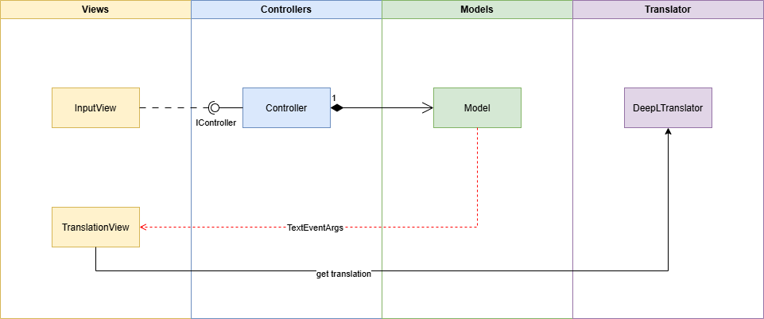

# MVC-Pattern

## Inhaltsverzeichnis

1. Einführung
2. Anwendungsstruktur
3. Projekte
   - MVCPattern.ConApp
   - MVCPattern.Logic
4. Wichtige Klassen und Dateien
   - Controllers
   - Models
   - Views
   - Translator
5. Build und Ausführung

## Einführung

Diese Solution implementiert eine einfache Anwendung eines MVC-Patterns (Model-View-Controller) in C#. Dabei soll ein Text in einer bestimmten Sprache (z.B. deutsch de) eingegeben werden und anschließend in unterschiedliche Sprachen (z.B. en, fr, es usw.) übersetzt werden und entsprechend in der Konsole ausgegeben werden. Die Anwendung besteht aus zwei Projekten:

- MVCPattern.ConApp
  - Dieses Projekt verwendet die MVC-Komponenten aus dem `Logic`-Projekt und simuliert einen Text-Translator in verschiedene Sprachen.
- MVCPattern.Logic
  - Implementierung der einzelnen Komponenten des MVC-Patterns und den Zugriff auf den Translator.

ALs Translator wird die DeepL API verwendet.

## Anwendungsstruktur

Die folgende Abbildung zeigt den Aufbau und die Interaktion der einzelnen Anwendung-Komponenten.



```csharp
MVCPattern/
├── MVCPattern.ConApp/
│   ├── MVCPattern.ConApp.csproj
│   └── Program.cs
├── MVCPattern.Logic/
│   ├── Controllers/
│   │   ├── Controller.cs
│   │   └── IController.cs
│   ├── Models/
│   │   ├── Model.cs
│   │   ├── Subject.cs
│   │   └── TextEventArgs.cs
│   ├── Translator/
│   │   ├── DeepLTranslator.cs
│   │   └── Translation.cs
│   ├── Views/
│   │   ├── InputView.cs
│   │   └── TranslationView.cs
│   ├── MVCPattern.Logic.csproj
├── MVCPattern.sln
```

## Projekte

MVCPattern.ConApp

Dieses Projekt ist die Konsolenanwendung, die als Einstiegspunkt dient. Die Hauptklasse ist `Program` in Program.cs.

MVCPattern.Logic

Dieses Projekt enthält die Logik des MVC-Musters, einschließlich der Controller, Models, Views und des Übersetzers.

## Wichtige Klassen und Dateien

### Controllers

- **Controller.cs**: Implementiert die

IController

-Schnittstelle und verwaltet die Interaktion zwischen Modell und View.

- **IController.cs**: Definiert die Schnittstelle für Controller.

### Models

- **Model.cs**: Repräsentiert das Modell, das die Daten und die Logik zur Benachrichtigung der Views enthält.
- **Subject.cs**: Abstrakte Klasse, die das Observer-Muster implementiert.
- **TextEventArgs.cs**: Stellt Daten für textbezogene Ereignisse bereit.

### Views

- **InputView.cs**: Stellt die Eingabeansicht dar, die Benutzereingaben entgegennimmt.
- **TranslationView.cs**: Stellt die Übersetzungsansicht dar, die die übersetzten Texte anzeigt.

### Translator

- **DeepLTranslator.cs**: Enthält die Logik zur Kommunikation mit der DeepL API.
- **Translation.cs**: Repräsentiert eine Übersetzung.

## Build und Ausführung

Um das Projekt zu bauen und auszuführen, verwenden Sie die folgenden Schritte:

1. Öffnen Sie die Solution in Visual Studio oder Visual Studio Code.
2. Stellen Sie sicher, dass die Abhängigkeiten installiert sind.
3. Führen Sie den Build-Prozess aus:
   ```sh
   dotnet build
   ```
4. Starten Sie die Anwendung:
   ```sh
   dotnet run --project MVCPattern.ConApp
   ```

Die Anwendung fordert Sie auf, einen DeepL-API-Schlüssel einzugeben und ermöglicht es Ihnen, Texte einzugeben, die dann in verschiedene Sprachen übersetzt werden.
